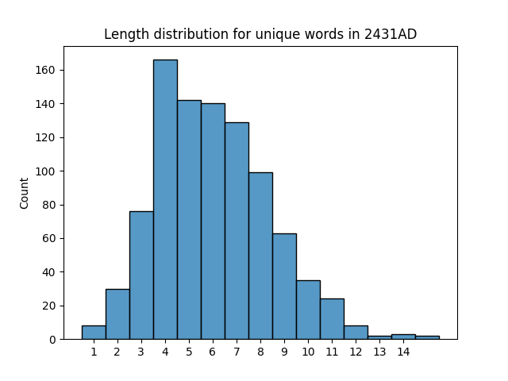

# Regexp HomeWork
Script "reg_script.py" has created the results below.
## Task 1
 Results are in the files "ftps" (all link cases) and "ftps_unique" (unique links)
## Task 2
All numbers in the text

* 2430
* 1969
* 2430
* 2430
* 57
* 57
* 1970
* 3
* 68
* 35
* 460
* 2430
## Task 3
All words with "a" character

established as stayed solar cages machinery animal and meant evaluate transferred was calories state planet inhuman sparsely persuaded variety animals vapors same quantity manner varieties idealist unable uneasily at guinea than favor resistance larger fan muscular varied unusual really finally achieved about abandoned libraries space ashamed say heard wasn carefully way all anywhere added reached peacefully waved deaths necessary harm original reaching wants after peak infants small wasted amphibians made personality war ate equal activities decades distance starship wait placidity unallayed hand around crazy head capable tall organized hair humanity annoyance inhabitants gleam tact years easy sympathy bears necessarily total social carnivores vast substance talk want last multiplication imitating fears advances chances human art gaze farms haven understand gray man dreaded above faded exactly compare blank representative peaceful alvarez amused called genetically standing calm sunlamps ran ready mankind face may passed ignorant prepared measure pale eventually carbon jaw earthlike thousands take preparations whatever paid wall flaw escape creatures continental shall largest care ache leading land came madness appropriate stairs literally jackass heat clear talked advance year family escaped asking placidly seared waiting rate planetary accepted estimated harvest perhaps remained rabbits great that insinuating throat disregarded regulated plants square case packed combination always brain act far heaved day has past someday universal stand half instance humans establishment character dreamed idea agree millennia greatest angrily plastic wasteful peace had accede along each again tolerated replaced death reason already treated matches many taken organic air because irradiated athletic intangible campbell ocean almost goal attempt amount departed situation placid large cannot also uninhabited nightmare celebrate margin asset mad acted dinosaurs earth voluntarily talking paused cranwitz an irritates audible stars deviants can changed sat exasperation hadn placoderms destination giant adjustment start wastes taking learn adjusted waited lizards maintained rather reach capacity walking have irritably chance saw plankton sea demanded blade dawn feared ask mammals conceivable steady replacement generation apartment back carry romanticized certain population gathered increase a magazine signaled learning asked another against trail real basked matter ad persuade father repaired grass what said are ago having contract avoided stare read normal rampways handing 
 ## Task 4
All sentences that end with "!"

* Yes!
* Literally!
* There was once a time!
* Centuries ago!
* Think, Cranwitz!
* If we succeed!
## Task 5
